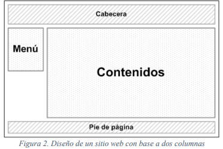
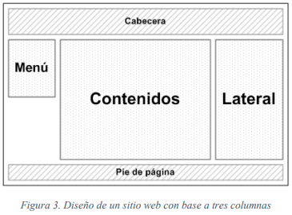
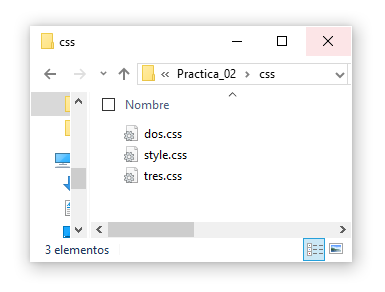
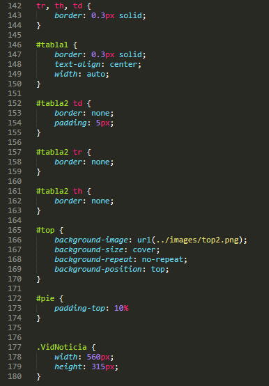
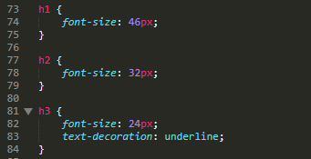
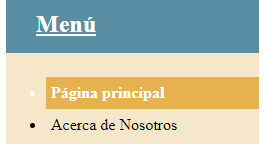
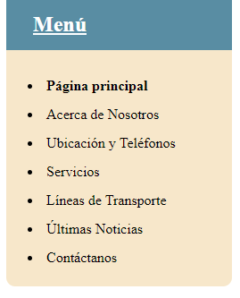
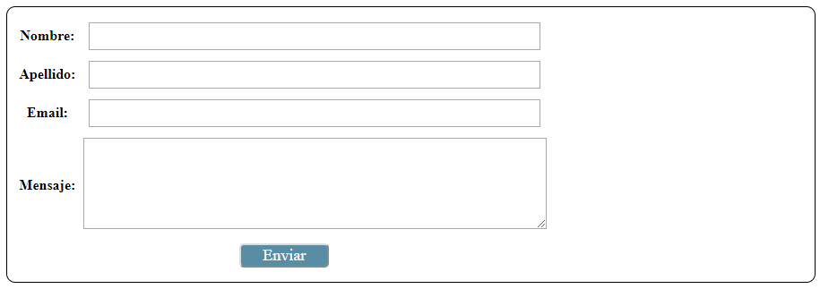
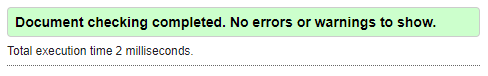
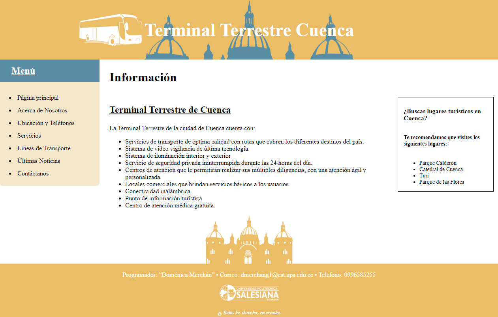

# Practica02_MiSitioWeb-CSS-

## 1.	Diseño con dos y tres columnas

##### Figura 1 Diseño de un sitio web con base a dos columnas

Se pide crear una página HTML con diseño a dos columnas con cabecera y pie de página como se muestra en la Figura 1. Para ello se crea un archivo .css que contenga las reglas necesarias para que una página HTML se presente a doble columna. 
El archivo creado se encuentra en la carpeta llamada css con el nombre dos.css
Dicho formato se puede apreciar en las siguientes páginas HTML:
-	Noticias.html
-	Contact.html

##### Figura 2 Diseño de un sitio web con base a tres columnas

De igual manera se pide que se creen páginas con formato de tres columnas con cabecera y pie de página como se muestra en la Figura 2. Para esto se crea un archivo css en la carpeta css con el nombre tres.css con las reglas necesarias para crear una página con tres columnas.
Los siguientes archivos mantienen este formato:
-	About.html
-	Index.html
-	Líneas.html
-	Servicios.html
-	Ubicación.html

## 2.	Carpeta de estilo

Todos los archivos .css se encuentran en la carpeta css. Existen tres archivos; dos para los formatos a doble y triple columna y uno para dar estilo de color, tamaño, etc. 

## 3.	Selectores

##### Figure 3 Ejemplos de selectores

Para dar estilo a las páginas HTML se utilizaron selectores de etiquetas, descendentes, por clase y por id. Todo esto se puede apreciar en el archivo style.css
En la Figura 3 se pueden apreciar algunos selectores usados en el proyecto.

## 4.	Títulos h1 – h6

##### Figure 4 Ejemplos de personalización de etiquetas h1 - h6

Se personalizaron también los títulos con las etiquetas h1 – h6. Se cambió el tamaño de letra, color, y/o decoración.
Esto se puede apreciar en el archivo style.css.
En la Figura 4 se puede ver algunos ejemplos.

## 5.	Pseudo – clases

Se requiere también hacer uso de pseudo – clases. Para esto se creó un estilo para el navegador. En cuanto este es señalado o se da click en alguna opción, su color de fondo cambia al igual que su estilo de letra.
Esto también se puede apreciar en los hipervínculos que se encuentran en la página noticias.html.
En la Figura 5 se puede apreciar como una de las opciones cambia su estilo cuando se le da click.
 
## 6.	Bordes

##### Figure 6  Menú de navegación

Para el menú de navegación se añade un estilo que redondea las esquinas. Además, se le añade un color de fondo y cada opción tiene una separación de 7px.
En la Figura 6 se puede apreciar el menú de navegación con los bordes redondeados en la parte posterior.

## 7.	Formulario

Finalmente se pide que se cree un formulario en una de las páginas HTML en donde se muestren los campos nombre, correo electrónico, mensaje y botón para enviar. 
Como se muestra en la Figura 7, los campos son implementados y se los puede apreciar en la página contact.html

##### Figure 7 Formulario

## 8.	Validación de los archivos CSS

Todos los archivos CSS fueron validados sin ningún error.

## 9.	CONCLUSIONES

A todas las páginas HTML se les agregó un formato de dos o tres columnas mediante un archivo css. Sin esto su estructura no puede ser apreciada por lo que es indispensable tener uno o más archivos de estilo que permita modificar la apariencia de la página HTML. La navegación, además, se vuelve más sencilla y intuitiva, lo que mejora notablemente la experiencia de usuario. 

